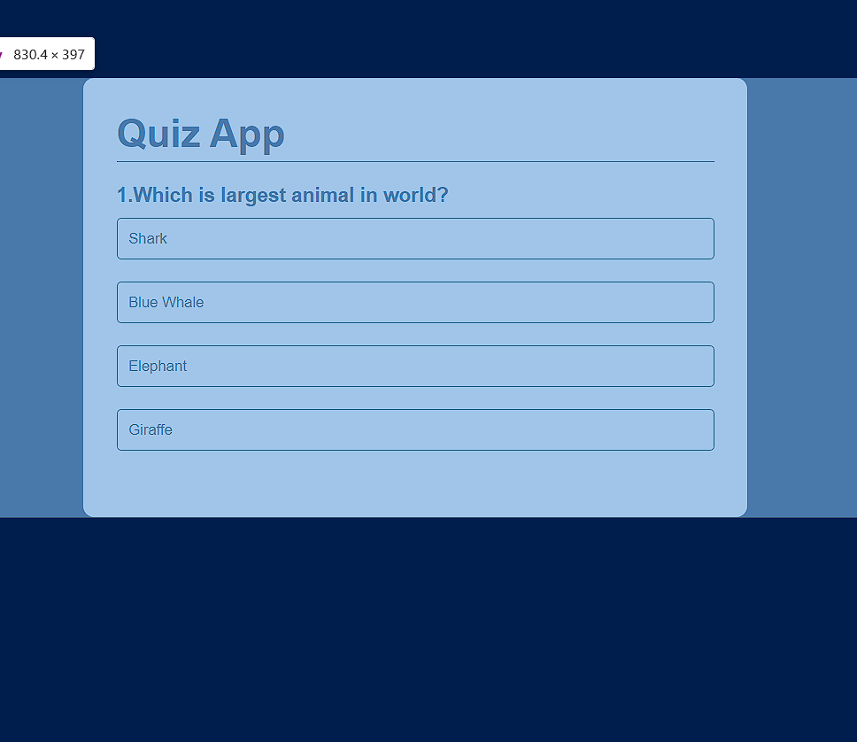
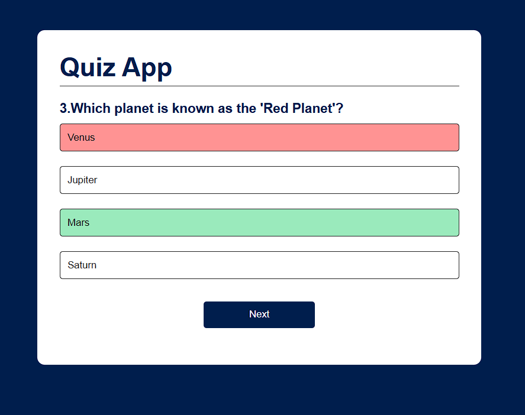
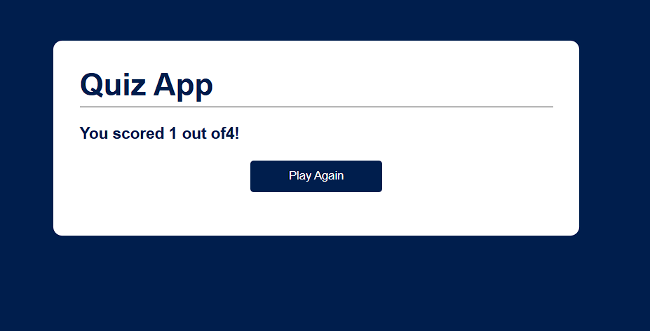

# Quiz App 🎓

An interactive and engaging Quiz App built using HTML, CSS, and JavaScript. This app allows users to test their knowledge across different topics with a simple and intuitive interface.

## Features 🌟

- Dynamic quiz questions with multiple-choice answers.
- Instant feedback on the correctness of answers.
- Score tracking throughout the quiz.
- Option to replay the quiz after completion.


## Installation Steps 🛠️

1. Clone the repository:


2. Open the `index.html` file in your browser:
   ```bash
   open index.html
   ```

## How to Use 🎮

1. Read the question displayed at the top.
2. Click on one of the answer buttons to select your answer.
3. Click "Next" to proceed to the next question.
4. At the end of the quiz, view your score and replay if desired.

## Technology Stack 🛠️

- HTML5
- CSS3
- JavaScript (ES6+)

## Code Highlights ✨

### Handling Answer Selection:
```javascript
function selectAnswer(e) {
    const selectBtn = e.target;
    const isCorrect = selectBtn.dataset.correct === "true";
    if (isCorrect) {
        selectBtn.classList.add("correct");
        score++;
    } else {
        selectBtn.classList.add("incorrect");
    }

    Array.from(ansBtn.children).forEach(button => {
        if (button.dataset.correct === "true") {
            button.classList.add("correct");
        }
        button.disabled = true;
    });
    nextBtn.style.display = "block";
}
```

### Displaying the Final Score:
```javascript
function showScore() {
    resetState();
    questionElement.innerHTML = `You scored ${score} out of ${questions.length}!`;
    nextBtn.innerHTML = "Play Again";
    nextBtn.style.display = "block";
}
```

## Screenshots 🖼️

### Main Interface:


### Correct Answer Highlighted:


### Final Score Display:


## Future Enhancements 🚀

- Add a timer for each question.
- Include different quiz categories.
- Provide detailed explanations for answers.
- Improve UI/UX with animations and themes.

## Acknowledgments 🙏

- Questions inspired by general knowledge trivia.
- Design concepts adapted from various online resources.

## License 🔒

This project is licensed under the MIT License.

---

I’m a beginner coder on a mission to create and learn. Your feedback means a lot!  
Contact me at: [derkaran@gmail.com](mailto:derkaran@gmail.com)  
Connect with me on LinkedIn: [](https://www.linkedin.com/in/karan-der/)

--- 
